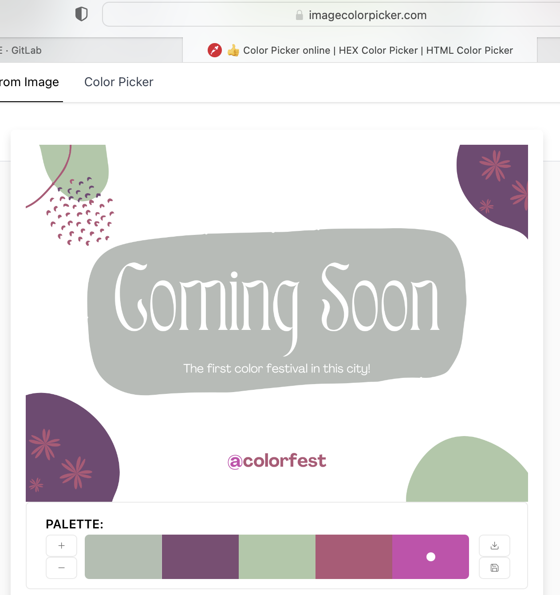

# Writeup **Color Pallete**
*Read this in other languages: [Indonesian](README.md), [English](README.en.md)*

Looking for a color palette (you can use tools on the internet, such as https://imagecolorpicker.com) of the dominant colors. White is not included because it does not have a specific wafelength (according to the hint : "If a color does not have specific wavelengths, then it is not a color, but still useful when it is needed")

Then sorted by its dominance:

* b6bbb7 (light gray)
* 734974 (dark purple)
* aec8a7 (light green)
* b35777 (dark pink)
* cb4bae (light pink)

Each hex combined to become : b6bbb7734974aec8a7b35777cb4bae  
Change it into base 64 : tru3c0l0rsins1d3y0uu 
flag : COMPFEST14{tru3c0l0rsins1d3y0uu}