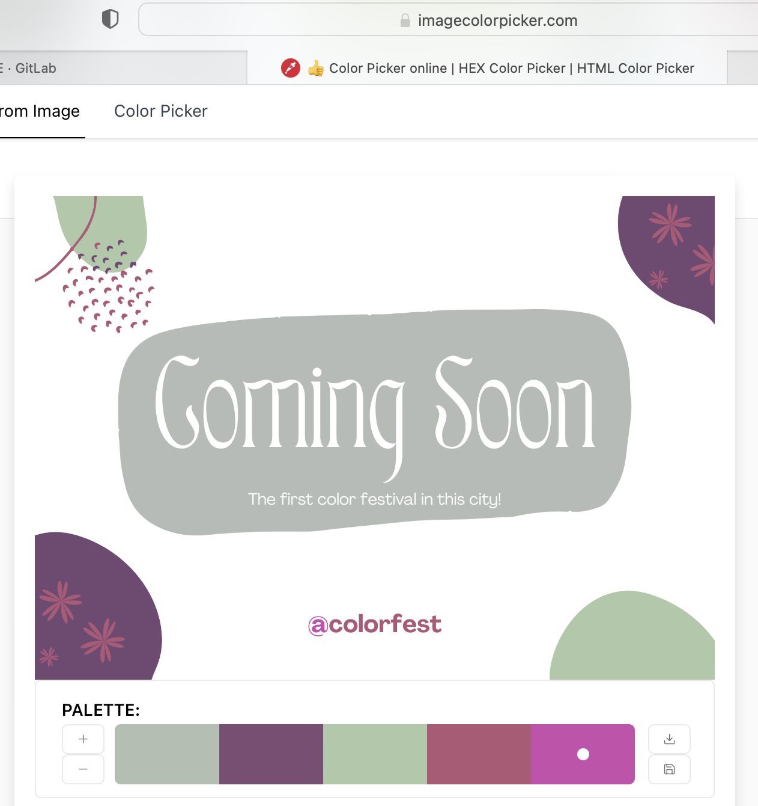

# Writeup **Color Pallete**
*Read this in other languages: [Indonesian](README.md), [English](README.en.md)*

Mencari color pallete (dapat menggunakan tools di internet, seperti https://imagecolorpicker.com)
dari warna-warna yang dominan. Warna putih tidak dimasukkan karena tidak memiliki spesifik wafelength (sesuai hint : "If a color do not have specific wavelengths, then it is not a color, but still useful when it is needed")

Kemudian diurutkan berdasarkan dominansinya :

* b6bbb7 (abu muda)
* 734974 (ungu tua)
* aec8a7 (hijau muda)
* b35777 (pink tua)
* cb4bae (pink muda)

Lalu hex-nya digabungkan menjadi : b6bbb7734974aec8a7b35777cb4bae  
Diubah ke base 64 : tru3c0l0rsins1d3y0uu  
flag : COMPFEST14{tru3c0l0rsins1d3y0uu}

